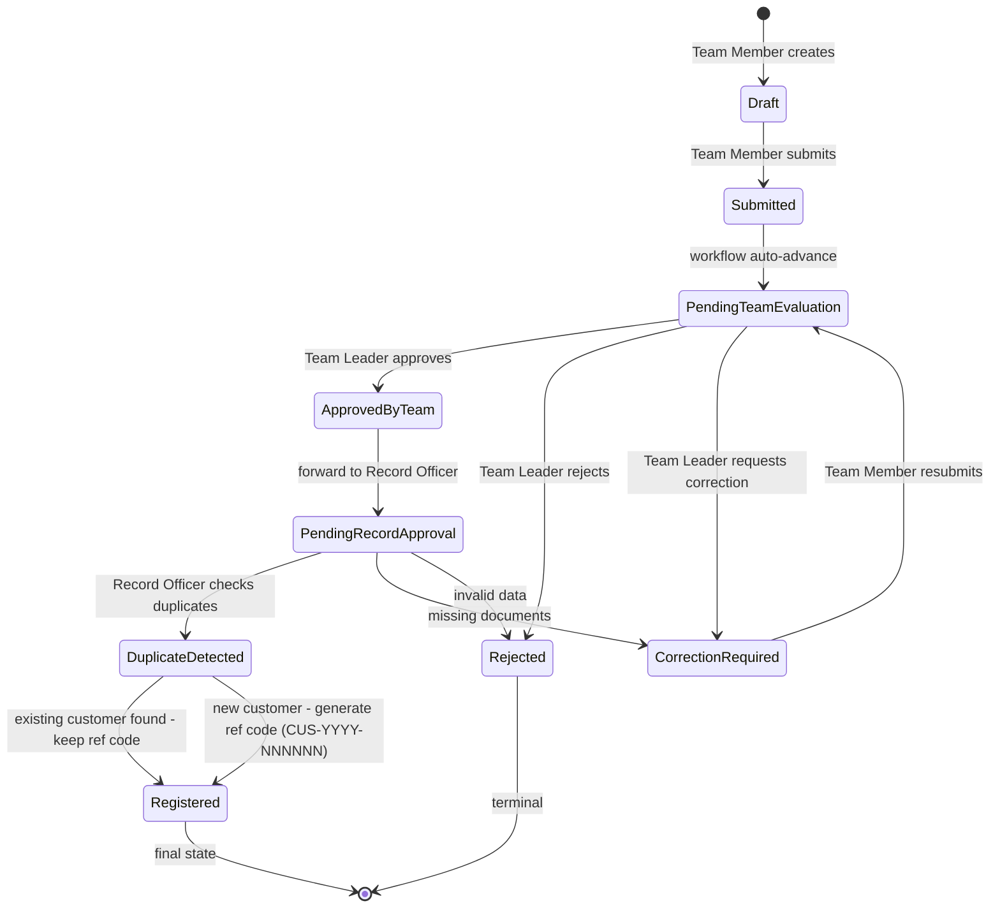
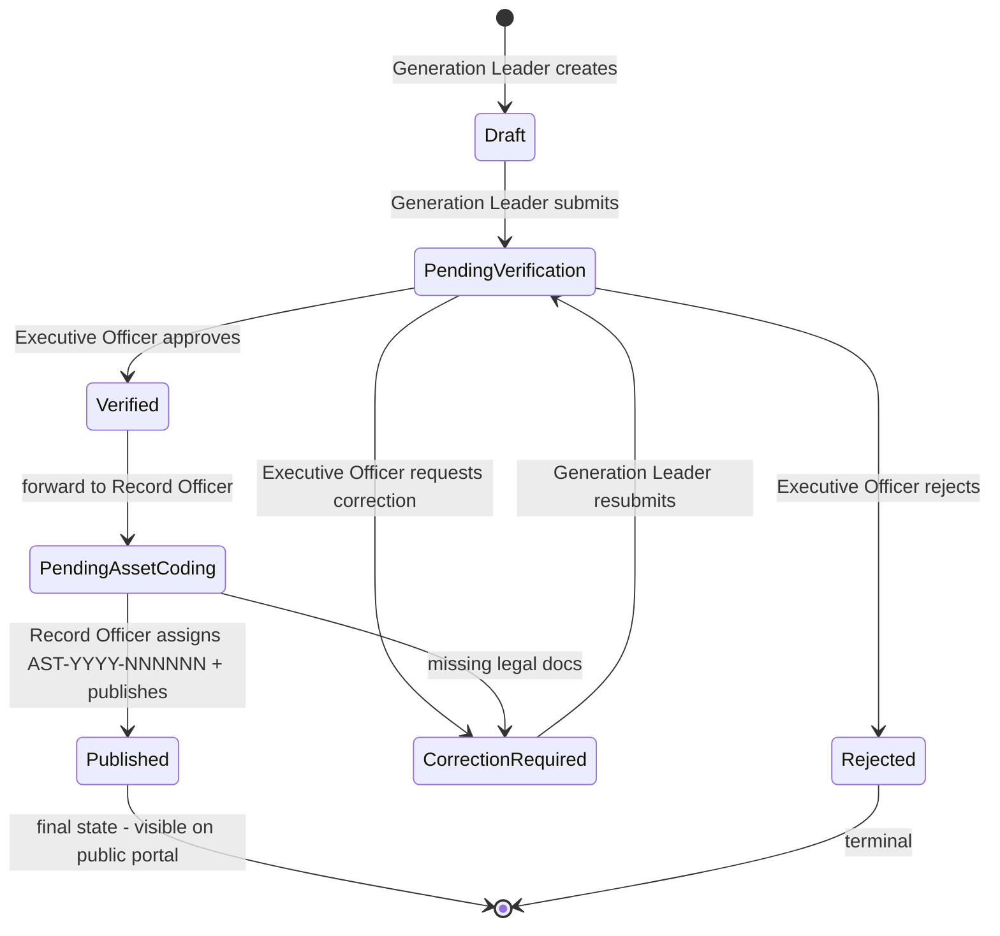
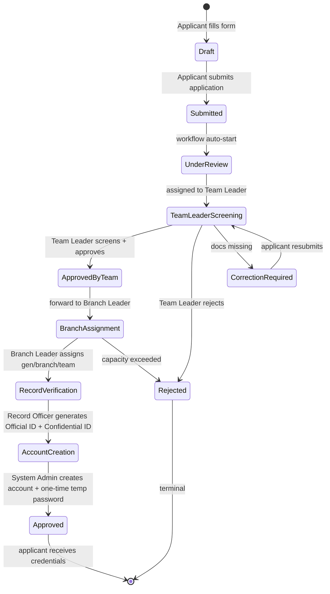
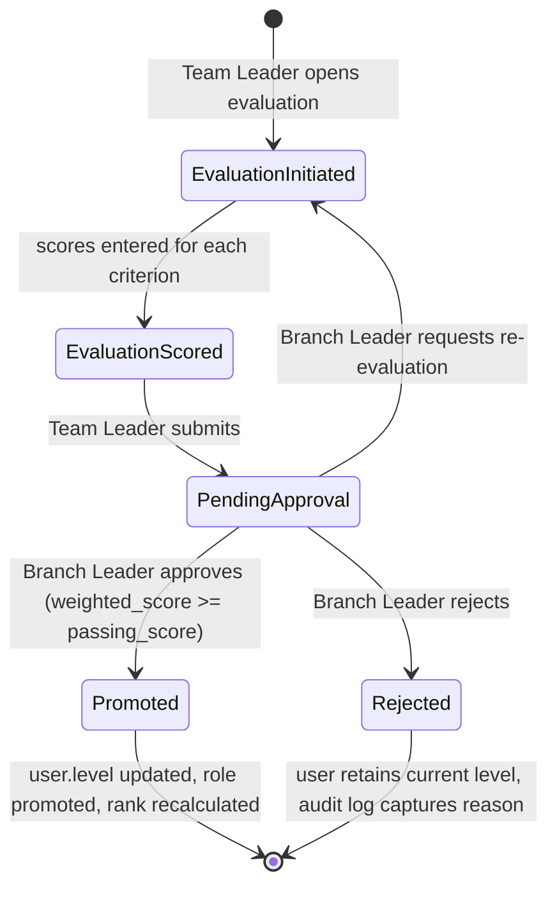
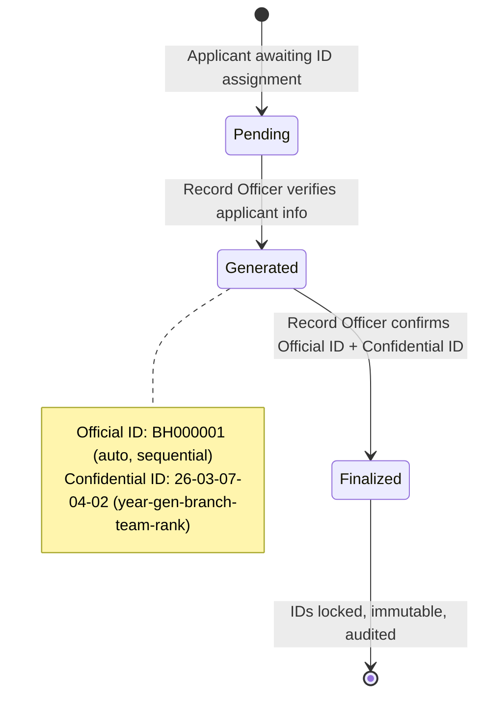
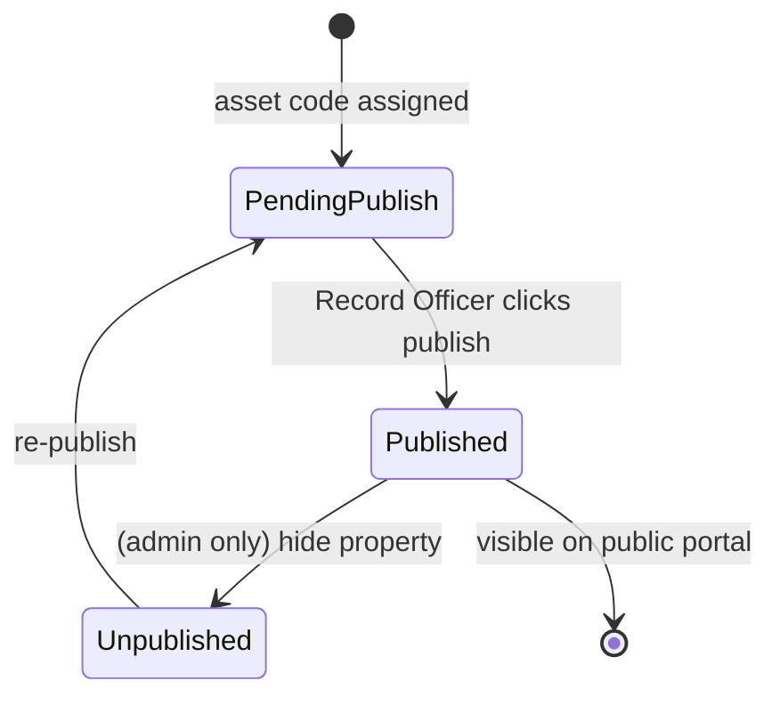

# Beha — Phase 1 Document 04: Workflow Diagrams

> Spec §42.D. State machines for the 6 workflows defined in `config/workflows.php`.
> Each diagram shows: states, transitions, actors, and side-effects.

---

## 1. Customer Registration Workflow



**Actors:**
- Team Member → drafts + submits
- Team Leader → evaluates + approves/rejects/requests correction
- Record Officer → verifies + duplicates check + finalizes registration

**Side-effects:**
- `Registered` triggers: customer_reference generated (if new), notification to Team Member, audit log, performance score bump for the team member.

---

## 2. Property Registration Workflow



**Actors:**
- Generation Leader → registers + submits
- Executive Officer → verifies
- Record Officer → assigns asset code + publishes

**Side-effects:**
- `Published` triggers: `properties.asset_code` set (immutable), `is_published = true`, `published_at` timestamp, notification to generation leader, audit log.

---

## 3. Applicant Onboarding Workflow



**Actors:**
- Applicant → self-signup + submit
- Team Leader → screens
- Branch Leader → assigns generation / branch / team (capacity-validated)
- Record Officer → generates dual IDs
- System Administrator → creates account + issues temp password

**Side-effects:**
- `RecordVerification` → ID generation event fired (auditable, immutable ID generation history)
- `AccountCreation` → temp password (cryptographically secure, hashed, 24h TTL) emailed + shown once in dashboard
- `Approved` → on first login, user is forced to `/password/force-change` (cannot access dashboard until changed)

---

## 4. Promotion / Evaluation Workflow



**Actors:**
- Team Leader → evaluates + scores
- Branch Leader → approves / rejects

**Side-effects:**
- `Promoted` triggers:
  - `team_members.level` updated (1→2, 2→3, 3→4, 4→5)
  - Role promoted if Level 2→3 (becomes Team Leader), 3→4 (Branch Leader), 4→5 (Generation Leader)
  - Performance ranking recalculation for affected team / branch / generation
  - Audit log entry `promote`
  - Notification to user + chain-of-command
- Evaluation template is **configurable** — admin can change criteria, weights, passing scores at any time.

---

## 5. ID Generation Workflow (Record Officer)



**Actors:**
- Record Officer → verifies + finalizes

**Side-effects:**
- `Generated` → IDs written to `users` table (confidential_id encrypted at rest)
- ID generation **immutable** — `id_sequences` row advanced atomically inside a DB transaction; **never reused**.
- All steps recorded in `id_generation_history` with `actor_user_id`, `applicant_id`, IP, timestamp.

---

## 6. Property Publication Workflow (subset of #2, post-asset-coding)



**Actors:**
- Record Officer → publishes
- System Administrator → can unpublish (audit-logged)

**Side-effects:**
- `Published` → `properties.is_published = true`, `published_at = now()`, public portal cache invalidated, notification to generation leader.
- Public portal **never** exposes internal confidential information (cost basis, owner details, internal notes).

---

## Workflow Engine Mechanics (shared)

Every workflow is implemented via the same engine:

```mermaid
flowchart LR
    A[Workflowable entity<br/>e.g. Customer] --> B[WorkflowService::start]
    B --> C[Create WorkflowInstance<br/>+ WorkflowStep[0]]
    C --> D[Notify current_owner]
    D --> E{User acts}
    E -->|approve| F[Advance step]
    E -->|reject| G[Mark rejected]
    E -->|correction| H[Revert to correction step]
    F --> I{Step is final?}
    I -->|no| D
    I -->|yes| J[Mark finalized<br/>+ side effects]
    G --> K[Notify creator]
    H --> L[Notify creator<br/>for resubmission]
    J --> M[Audit log + events]
    K --> M
    L --> M
```

**WorkflowInstance tracks:**
- `workflow_type`, `subject_type`, `subject_id` (polymorphic)
- `current_step`, `current_owner_user_id`
- `created_by_user_id`, `status`
- Timestamps + soft delete

**WorkflowHistory tracks every transition:**
- `from_step`, `to_step`, `actor_user_id`, `action`, `comment`, `ip_address`, `user_agent`, `created_at`

---

## Common Transition Rules (spec §41)

| Rule # | Enforcement point                                       |
|--------|---------------------------------------------------------|
| #8     | Users cannot bypass workflow steps — `WorkflowService::advance()` validates `current_step` matches request step |
| #11    | Users cannot approve own submissions — `advance()` rejects when `actor_id === current_owner_id` |
| #13    | Every approve/reject audited — `WorkflowService` writes to `audit_logs` inside the same transaction |
| #19    | All transitions transactional — `DB::transaction()` wraps `advance() / reject()` |
